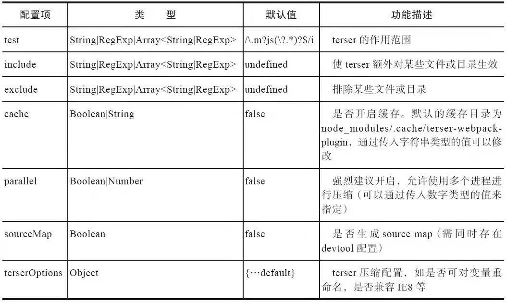

# 压缩JS
webpack中默认使用terser的插件terser-webpack-plugin,这项配置在config.optimization.minimize。如果webpack中已经开启了mode:production，则不需要再人为设置。  
**常用自定义配置**    

  

```
const TerserPlugin = require('terser-webpack-plugin');
module.exports={
    //...
    optimization:{
        //覆盖默认的minimizer
        minimizer:[
            new TerserPlugin({
                /*your config*/
                test:/\.js(\?.*)?$/i,
                exclude:/\/excludes/,
            })
        ],
    },
};
```
# 压缩CSS
使用optimize-css-extract-plugin将样式提取出来，接着使用optimize-css-assets-webpack-plugin来进行压缩。