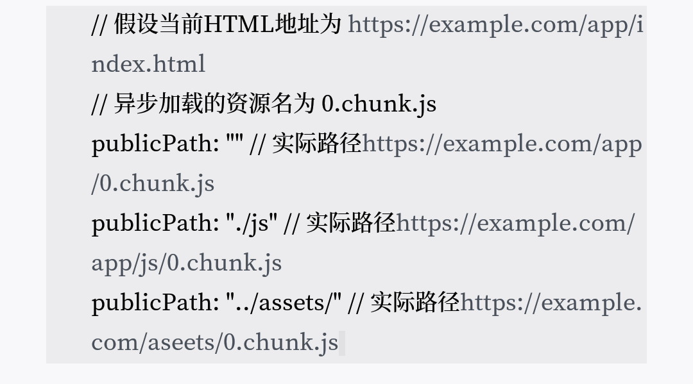
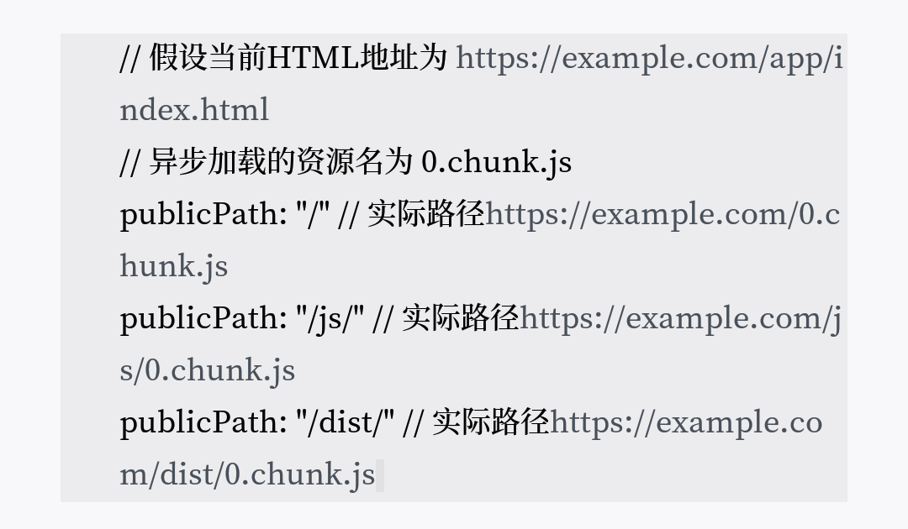
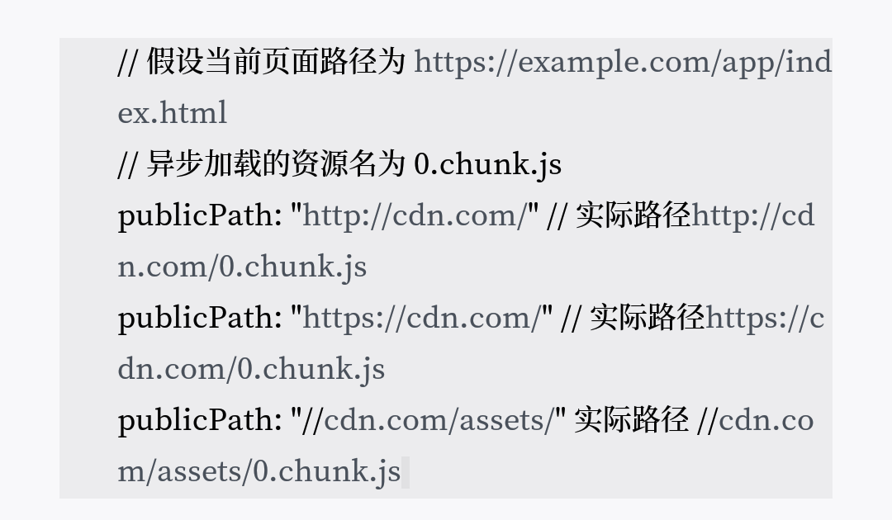

# 配置资源出口output--output
```
const psth = require('path')
module.exports={
    entry:'./src/app.js',
    output:{
        filename:'bundle.js',
        path:path.join(__dirname,'assets'),
        publicPath:'/dist/',
    },
};
```
## filename
作用是控制输出资源的文件名  
- 在多入口的场景中  
  Webpack支持使用一种类似模板语言的形式动态地生成文件名。
  ```
  module.exports={
      entry:{
          app:'./src/app.js',
          vendor:'./src/vendor.js',
      },
      output:{
          filename:'[name].js',
      },
  };
  ```
  filename中的[name]会被替换成chunk name,即最后生成的资源是vendor.js和app.js。
- filename配置项模板变量   
   
  

## path
指定资源输出的位置，要求必须为绝对路径
```
const path=require('path');
module.exports={
    entry:'./src/app.js',
    output:{
        filename:'bundle.js',
        path:path.join(__dirname,'dist'),
    },
};
```
上述配置将资源输出位置设置为工程的dist目录。
## publicPath
用来指定资源的请求位置
- 请求位置：由JS或CSS所请求的间接资源路径。页面中的资源分为两种，一种是由HTML页面直接请求的，比如通过script标签加载的JS；另一种是由JS或CSS请求的，如异步加载的JS、从CSS请求的图片字体等。publicPath的作用就是指定这部分间接资源的请求位置。  
### 三种形式
- 1. HTML相关  
  将publicPath指定为HTML的相对路径，在请求这些资源时会以当前页面HTML所在路径加上相对路径，构成实际请求的URL。如：  
  
- 2. Host相关  
  若publicPath的值以“/”开始，则代表此时publicPath是以当前页面的host name为基础路径的。如：  
  
- 3. CDN相关  
  当publicPath以协议头或相对协议的形式开始时，代表当前路径是CDN相关。如：  
  
