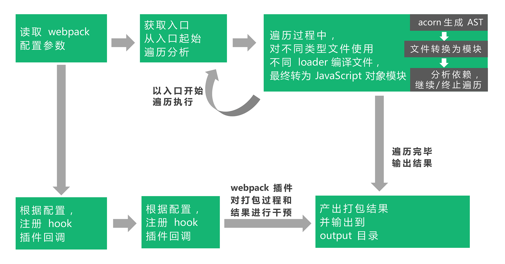
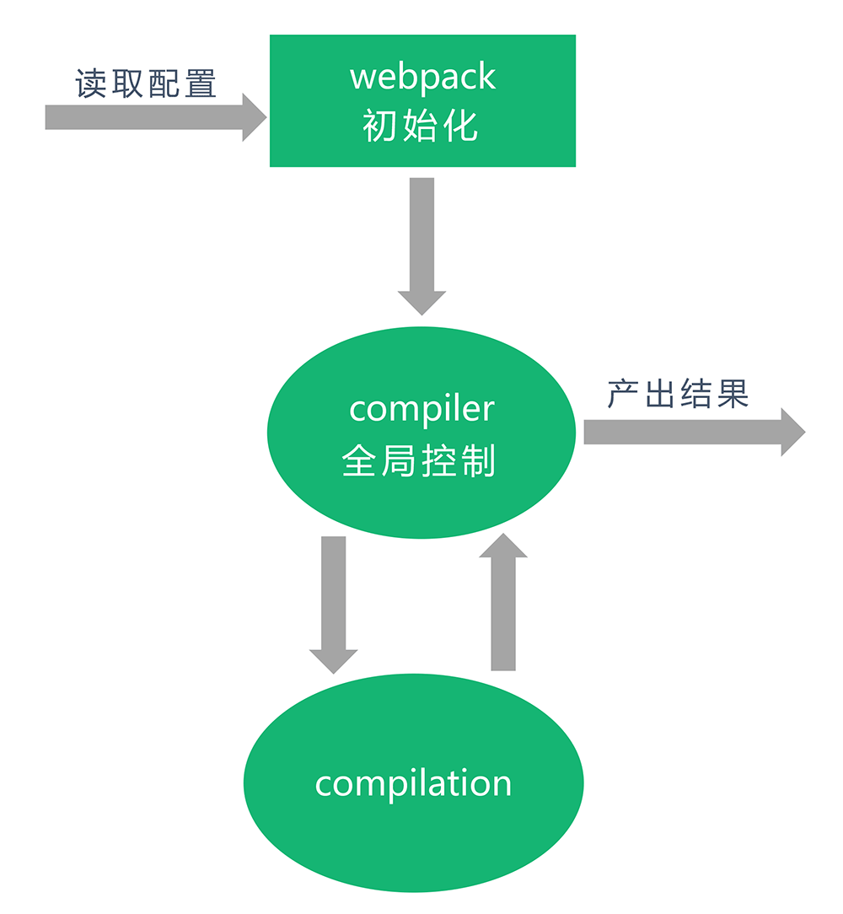
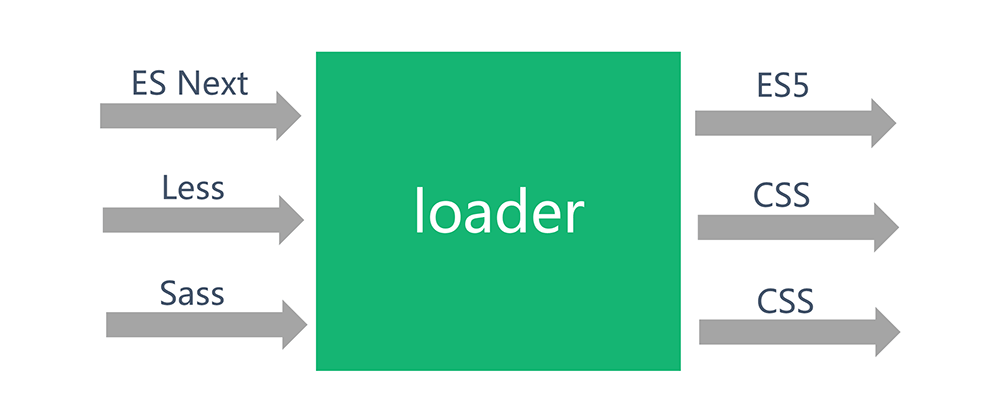
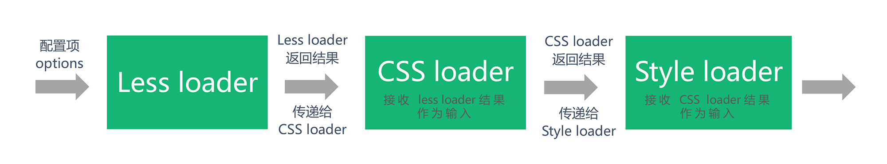

# webpack工作基本原理
  

- 首先，webpack会读取项目中由开发者定义的webpack.config.js配置文件，或者从shell语句中获得必要的参数
- 接着，实例化所需webpack插件，在webpack事件流上挂载插件钩子
- 同时，根据配置所定义的入口文件，以入口文件(可以不止有一个)为起始，进行依赖收集：对所有依赖的文件进行编译，这个编译过程依赖loaders,不同类型文件根据开发者定义的不同loader进行解析。编译好的内容使用acorn或其他抽象语法树能力，解析生成AST静态语法树，分析文件依赖关系，将不同模块化语法(如require)等替换为__webpack_require__,即使用webpack自己的加载器进行模块化实现
- 产出结果，打包到相应目录  


在整个打包过程中，**webpack和插件采用基于事件流的发布订阅模式，监听某些关键过程，在这些环节中执行插件任务。**  

模块会经历加载(loaded)、封装(sealed)、优化(optimized)、分块(chunked)、哈希(hashed)和重新创建(restored)等步骤

## compiler和compilation
  

- compiler对象：它的实例包含了完整的webpack配置，全局只有一个compiler实例。当插件被实例化的时候，会收到一个compiler对象，通过这个对象可以访问webpack的内部环境
- compilation对象：当webpack以开发模式运行时，每当检测到文件变化，一个新的compilation对象将被创建。这个对象包含了当前的模块资源、编译生成资源、变化的文件等消息。所有构建过程中产生的构建数据都存储在该对象上，它掌握着构建过程中的每一个环节。


## webpack loader
**loader就是接受源文件，对源文件进行处理，返回编译后文件**  

  

```
module.exports = {
  ...
  module: {
    rules: [{
      test: /\.less$/,
      use: [{
        loader: 'style-loader' // 通过 JS 字符串，创建 style node
      }, {
        loader: 'css-loader' // 编译 css 使其符合 CommonJS 规范
      }, {
        loader: 'less-loader' // 编译 less 为 css
      }]
    }]
  }
}
```
- loader的执行顺序是和配置顺序相反的，即配置的最后一个loader最先执行，第一个loader最后执行
- 第一个执行的loader接收源文件内容作为参数，其他loader接受前一个执行的loader的返回值作为参数。最后执行的loader会返回最终结果  

  

loader本质就是函数，其最简单的结构为：  
```
module.exports = function (source){
    //some magic...
    return content
}
```

## webpack plugin
- loader其实就是一个转换器，执行单纯的文件转换操作
- plugin是一个扩展器，在loader过程结束后，webpack打包的整个过程中，webpack plugin并不直接操作文件，而是基于事件机制工作，监听webpack打包过程中的某些事件，见缝插针，修改打包结果