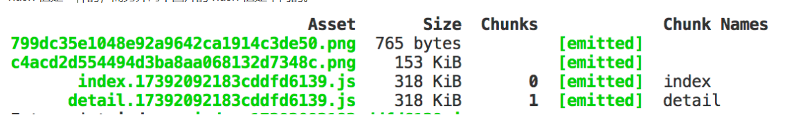
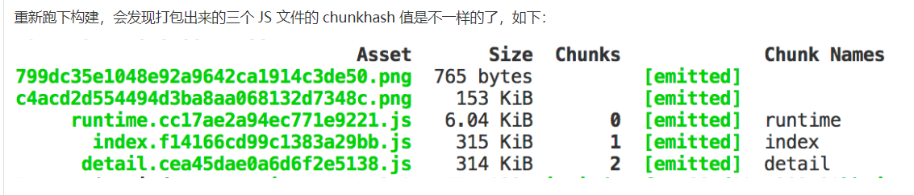
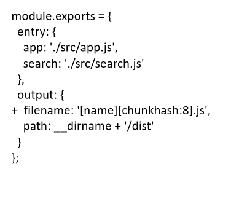
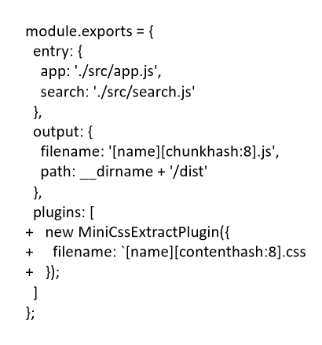
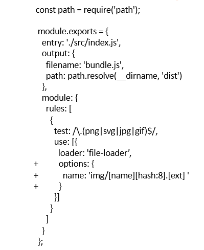
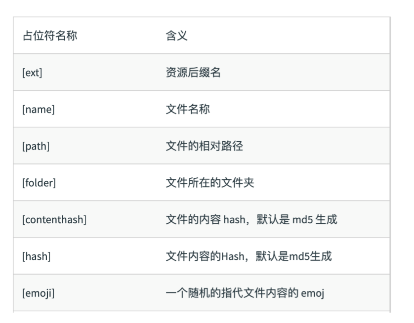

# 文件指纹
打包后输出的文件名的后缀
## 1.文件指纹的生成
- Hash：和整个项目的构建相关，只要项目文件有修改，整个项目构建的 hash 值就会更改。  
所以一旦修改了任何一个文件，整个项目的文件缓存都将失效。
```
module.exports = {
  mode: 'none', // 设置为 none，避免 development 或 production 默认设置的一些影响
  entry: {
    index: './src/index.js', 
    detail: './src/detail.js',
  },
  output: {
    filename: '[name].[hash].js',
    path: path.resolve(__dirname, 'dist')
  }
}
```
webpack 默认为给各个模块分配一个 id 以作标识，用来处理模块之间的依赖关系。而默认的 id 命名规则是根据模块引入的顺序，赋予一个整数(1、2、3……)。如下图就是使用 hash 的打包，index 和 detail 作为 entry 的两个入口，可以看到其 hash 值是一样的，而另外两个图片的 hash 值是不同的。  
    

由于该 hash 是基于整个 module identifier 序列计算得到的，所以 JS 或 CSS 文件如果使用该 hash，则所有值都一样，而任意增添或删减一个模块的依赖，都会对整个 id 序列造成影响，从而改变 hash 值。这样的话 JS 或 CSS 文件是不适合使用该 hash 值的。
- Chunkhash：和 webpack 打包的 chunk 有关，不同的 entry 会生成不同的 chunkhash 值  
在生产环境里把一些公共库和程序入口文件区分开，单独打包构建，接着我们采用chunkhash的方式生成哈希值，那么只要我们不改动公共库的代码，就可以保证其哈希值不会受影响。
```
output: {
  filename: '[name].[chunkhash].js',
  path: path.join(__dirname, 'dist')
}
```  
  
    
  
- Contenthash：根据文件内容来定义 hash ，文件内容不变，则 contenthash 不变  
使用 mini-css-extract-plugin 或 extract-text-webpack-plugin 把 CSS 文件抽离出来：
```
// mini-css-extract-plugin
const miniCssExtractPlugin = require('mini-css-extract-plugin')

module.exports = {
  module: {
    rules: [
      {
        test: /\.css$/,
        use: [
          miniCssExtractPlugin.loader,
          'css-loader'
        ]
      }
    ]
  },
  plugins: [
    new miniExtractPlugin({
      filename: '[name].[contenthash].css'
    })
  ]
}
```
## 2.文件指纹设置
### 2.1 JS的文件指纹设置
设置output的filename,使用[chunkhash]  

### 2.2 CSS的文件指纹设置
设置MiniCssExtractPlugin的filename,使用[contenthash]  

### 2.3 图片的文件指纹设置
设置file-loader的name,使用[hash]    


## 3.占位符  

