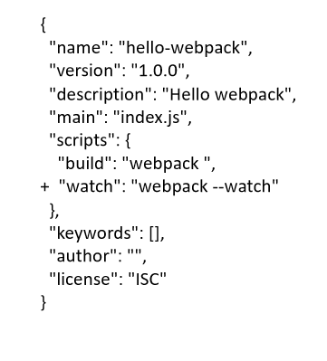

# 文件监听
文件监听是在发现源码发生变化时，⾃动重新构建出新的输出⽂件
## 1.使用webpack进行文件监听
唯一缺陷：每次需要手动刷新浏览器
### 1.1启动webpack命令时，带上--watch参数

### 1.2在配置webpack.config.js中设置watch:true
```
module.export = {
    //只有开启监听模式时，watchOptions才有意义
    //默认false，也就是不开启
    watch: true,
    wathcOptions: {
        //不监听的文件或者文件夹，支持正则匹配
        //默认为空
        ignored: /node_modules/,
        //监听到变化发生后会等300ms再去执行动作，防止文件更新太快
        //默认为300ms
        aggregateTimeout: 300,
        //判断文件是否发生变化是通过不停询问系统指定文件有没有变化实现的
        //默认每秒问1000次
        poll: 1000
    }
}
```
### 1.3原理
在webpack中监听一个文件发生变化的原理是定时的去获取这个文件的最后编辑时间，每次都存下最新的最后编辑时间，如果发现当前获取的和最后一次保存的最后编辑时间不一致，就认为该文件发生了变化。配置项中的watchOptions.poll就是用于控制定时检查的周期，具体含义是检查多少次。  
当发现某个文件发生了变化，并不会立刻告诉监听者，而是先换成起来，收集一段时间的变化后，再一次性告诉监听者，配置项中的watchOptions.aggregateTimeout就是用于配置这个等待时间。这样做的目的是因为我们在编辑代码的过程中可能会高频的输入文字导致文件变化的事件高频的发生，如果每次都重新执行构建就会让构建卡死。

