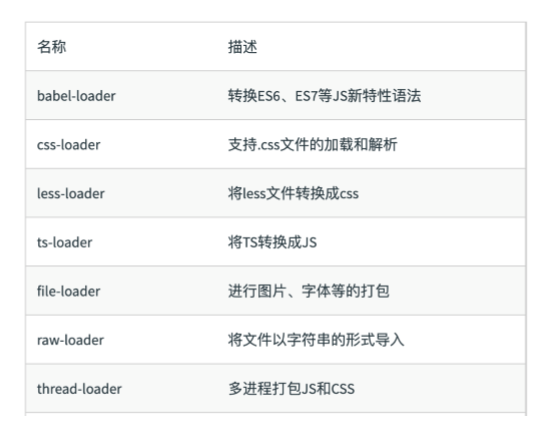
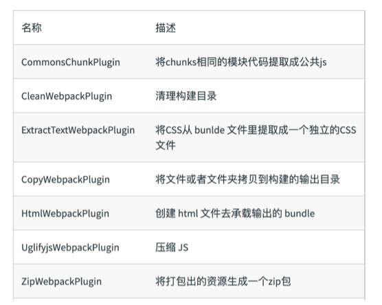
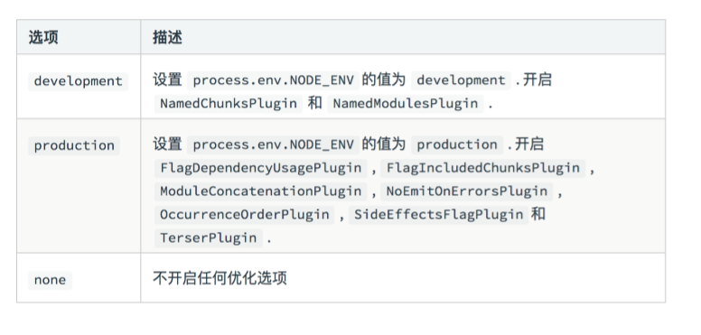

## 1.Entry
Entry ⽤用来指定 webpack 的打包⼊入⼝口
### 用法
- 单⼊入⼝口：entry 是⼀一个字符串串
```
module.exports = {
     entry: './path/to/my/entry/file.js' 
     }; 
```
- 多⼊入⼝口：entry 是⼀一个对象 
```
module.exports = {
     entry: {
          app: './src/app.js',
          adminApp: './src/adminApp.js'
           }
        };
```
## 2.Output
Output ⽤用来告诉 webpack 如何将编译后的⽂文件输出到磁盘
- filename 用于输出文件的文件名。
- 目标输出目录 path 的绝对路径。
### 2.1单⼊入⼝口配置
```
module.exports = {
    entry: './path/to/my/entry/file.js'
    output: {
         filename: 'bundle.js’,
          path: __dirname + '/dist'
           }
 };
```
### 2.2多⼊入⼝口配置
```
{
  entry: {
    app: './src/app.js',
    search: './src/search.js'
  },
  output: {
    filename: '[name].js',  //使用占位符(substitutions)来确保每个文件具有唯一的名称。
    path: __dirname + '/dist'
  }
}

// 写入到硬盘：./dist/app.js, ./dist/search.js
```
## 3.Loaders
loader 用于对模块的源代码进行转换。  
webpack开箱即用只支持JS 和JSON 两种文件类型，通过Loaders 去支持其它文
件类型并且把它们转化成有效的模块，并且可以添加到依赖图中。  
本身是一个函数，接受源文件作为参数，返回转换的结果。
### 3.1常见的Loaders

### 3.2 Loaders用法
- 首先安装相对应的 loader：
```
npm install --save-dev css-loader
npm install --save-dev ts-loader
```
- 然后在module.rules中配置指定的loader
```
module.exports = {
  module: {
    rules: [
      {
        test: /\.css$/,     //test 指定匹配规则 
        use: 'css-loader'   //use 指定使⽤用的 loader 名称
    },
      { test: /\.ts$/, use: 'ts-loader' }
    ]
  }
};
```
## 4.Plugins
插件⽤用于 bundle ⽂文件的优化，资源管理理和环境变量量注⼊入  
作⽤用于整个构建过程
### 4.1常见的Plugins

### 4.2 Plugins的用法
由于插件可以携带参数/选项，你必须在 webpack 配置中，向 plugins 属性传入 new 实例。
```
const HtmlWebpackPlugin = require('html-webpack-plugin'); //通过 npm 安装
const webpack = require('webpack'); //访问内置的插件
const path = require('path');

const config = {
  entry: './path/to/my/entry/file.js',
  output: {
    filename: 'my-first-webpack.bundle.js',
    path: path.resolve(__dirname, 'dist')        //path.resolve方法用于将相对路径转为绝对路径。
  },
  module: {
    rules: [
      {
        test: /\.(js|jsx)$/,
        use: 'babel-loader'
      }
    ]
  },
  plugins: [
    new webpack.optimize.UglifyJsPlugin(),
    new HtmlWebpackPlugin({template: './src/index.html'})
  ]
};

module.exports = config;
```
## 5.Mode
Mode ⽤用来指定当前的构建环境是：production、development 还是 none  
设置 mode 可以使⽤用 webpack 内置的函数，默认值为 production
### 5.1 Mode的内置函数功能

```
module.exports = {
  mode: 'production'
};
```