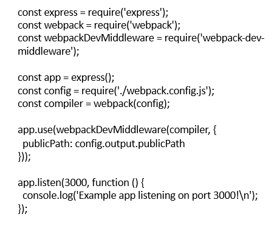

# 热更新
使得应用在运行状态下，不重载刷新就能更新、增加、移除模块的机制  
就是 在应用程序的开发环境，方便开发人员在不刷新页面的情况下，就能修改代码，并且直观地在页面上看到变化的机制。
## 1.热更新配置
- 使用 HotModuleReplacementPlugin 插件
```
// webpack.config.js
module.exports = {
  // ...
  plugins: [
    webpack.HotModuleReplacementPlugin(),
   // ...
  ]
}

```
- 打开 webpack-dev-server 的热更新开关
```
// webpack.config.js
module.exports = {
  // ...
  devServer: {
    hot: true,
    // ...
  }
}

```
## 2.webpack-dev-middleware  
webpack-dev-middleware是一个容器，它的作用是将webpack处理后的文件传递给server  
在监视模式(watch mode)下如果文件发生改变，middleware 會馬上停止提供bundle 並且延迟请求的回应直至编译完成，如此一來我们就不需要去观察编译是否结束了    

参数
- compiler：可以通过 webpack(webpackConfig) 得到
- options：补充 webpack-dev-middleware 需要的特定选项，其中 publicPath(表示对应的处理文件路径) 是必须的。  

实现热更新必须使用webpack-hot-middleware插件，该插件通过webpack的HMR API，浏览器和服务器之间建立连接并接收更新。它只专注于webpack和浏览器之间的通信机制。    

