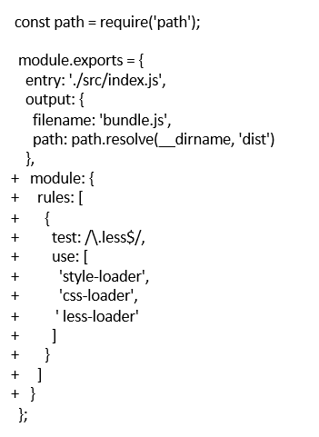

## 1.解析ES6
使用 babel-loader  
babel的配置文件是：.babelrc
### 1.1修改 webpack.config.js 配置文件：
首先安装该模块：  
 cnpm i --save-dev babel-loader。  
 通过 babel-loader 可以在 webpack 编译过程中自动解析 ES6 代码

### 1.2实现上述配置
-  利用.babelrc 配置文件完成配置  

    babel-loader 解析ES6的语法也是需要知道哪些语法需要解析，需要通过.babelrc进行配置，这个@babel/preset-env 就是告诉 babel-loader 要解析ES6的语法，其它的 react 语法可以通过其它的 babel preset 进行
```
{
    "presets": [
        "@babel/preset-env"
    ]
}
```
## 2.解析 react JSX

## 3.解析CSS
css-loader 用于加载 .css ⽂文件，并且转换成 commonjs 对象   

style-loader 将样式通过 \<style> 标签插⼊入到 head 中

## 4.解析Less和SaSS
less-loader ⽤用于将 less 转换成 css   

    

此处 webpack 选择的是 compose 方式，从右到左依次执行 loader，每个 loader 是一个函数。  
style-loader: 向 DOM 插入 style 标签，并且将样式插入进去，这样网页才能解析到  
css-loader: 可以让 webpack 解析 css(因为 webpack 原生只支持 js 和 json 的解析)，并且将解析出来的 css 转换成一个对象，插入到 JS 里面去。  
less-loader: 将 less 转换成 css
## 5.file-loader解析图片、字体
file-loader ⽤于处理文件
  
  
  
file-loader 也可以用于处理字体  

## 6.使⽤用 url-loader  
url-loader 也可以处理图片和字体  
可以设置较⼩小资源⾃自动 base64   
url-loader对未设置或者小于limit设置的图片进行转换，以base64的格式被img的src所使用；而对于大于limit byte的图片用file-loader进行解析。  
  
### 6.1url-loader配置
  
- limit  
    limit 用于配置需内联的文件字节限制，类型是 Number，默认值为 undefined。如果文件大于限制（以字节为单位），该文件将交由 file-loader 处理 ，并将所有查询参数传递给它。
```
{
  loader: 'url-loader',
  options: {
    limit: 8192
  }
}
```
- mimetype  
mimetype 用于设置文件的 MIME 类型。如果未指定，则将使用文件扩展名来查找对应的 MIME 类型。
```
{
  loader: 'url-loader',
  options: {
    mimetype: 'image/png'
  }
}
```
- fallback  
fallback 用于设置当 url-loader 加载的文件大于限制时，所对应的处理器。类型是 String，默认值是 “file-loader”。
```
{
  loader: 'url-loader',
  options: {
    fallback: 'responsive-loader'
  }
}
```