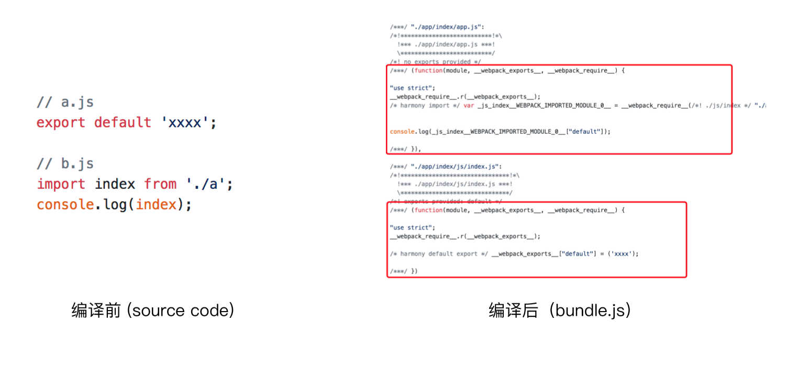

# tree shaking(摇树优化)
概念：：1 个模块可能有多个⽅法，只要其中的某个方法使⽤到了，则整个文件都会被打到 bundle 里面去，tree shaking 就是只把用到的方法打入 bundle ，没用到的方法会在 uglify 阶段被擦除掉。  
使用：webpack默认支持，在.babelrc里设置modules:false即可  
production mode的情况下默认开启  
要求：必须是ES6的语法,CJS的方式不支持
# DCE(Dead code elimination)
- 代码不会被执行，不可到达
- 代码执行的结果不会被用到
- 代码只会影响死变量(只写不读)
```
if(false){
    console.log('这段代码永远不会执行');
}
```
# Tree-shaking原理
利用ES6模块的特点：
- 只能作为模块顶层的语句出现
- import的模块名只能是字符串常量
- import binding是immutable的  
代码擦除：uglify阶段删除无用代码
# 现象：构建后的代码存在大量闭包代码

