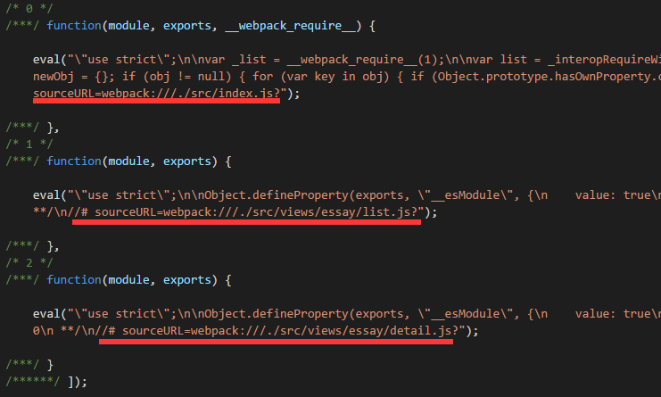
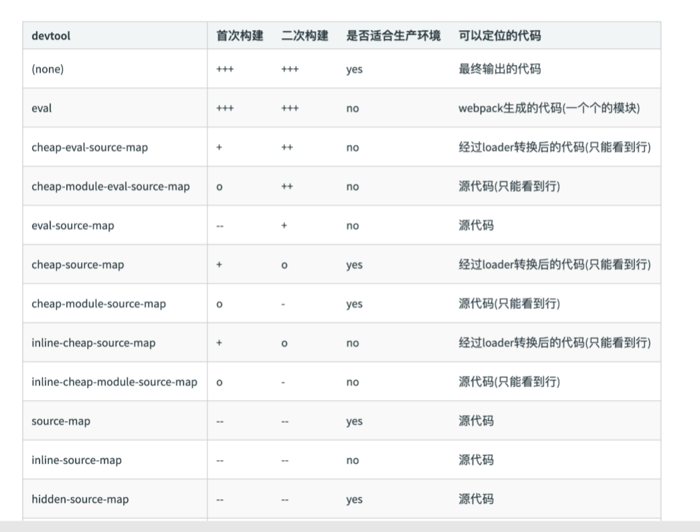

# 使用source map
## 作用：通过source map定位到源代码
## 开发环境开启，线上环境关闭
- 线上排查问题的时候可以将source map上传到错误监控系统  
  
Source map就是一个信息文件，里面储存着位置信息。也就是说，转换后的代码的每一个位置，所对应的转换前的位置。  

有了它，出错的时候，除错工具将直接显示原始代码，而不是转换后的代码。
# source map关键字
- eval:使用eval包裹模块代码
  

- source map:产生.map文件
```
webpackJsonp([1],[  
function(e,t,i){...},  
function(e,t,i){...},  
function(e,t,i){...},  
function(e,t,i){...},
  ...
])//# sourceMappingURL=index.js.map
```
打包后的模块在模块后面会对应引用一个.map文件，同时在打包好的目录下会针对每一个模块生成相应的.map文件，在上例中会生成一个index.js.map文件，这个文件是一个典型的sourcemap文件，形式如下：
```
{  
"version":3,  
"sources":[
    "webpack:///js/index.js","webpack:///./src/js/index.js",    
    "webpack:///./~/.npminstall/css-loader/0.23.1/css-loader/lib/css-base.js",
    ...
],  
"names":["webpackJsonp","module","exports"...], 
"mappings":"AAAAA,cAAc,IAER,SAASC...",  
"file":"js/index.js",  
"sourcesContent":[...],  
"sourceRoot":""
}
```
- cheap:不包含列信息  
cheap属性在打包后同样会为每一个模块生成.map文件，但是与source-map的区别在于cheap生成的.map文件会忽略原始代码中的列信息。
```
devtool: 'eval-source-map'

"mappings": "AAAAA,QAAQC,GAAR,CAAY,aAAZ",
devtool: 'cheap-source-map'

"mappings": "AAAA",
```
- inline:将.map作为DataURL嵌入，不单独生成.map文件  
```
webpackJsonp([1],[  
function(e,t,i){...},  
function(e,t,i){...},  
function(e,t,i){...},  
function(e,t,i){...},
  ...
])
//# sourceMappingURL=data:application/json;charset=utf-8;base64,eyJ2ZXJzaW9...
```
打包好模块后，在sourceMappingURL中直接将.map文件中的内容以DataURL的方式引入。
- module：包含loader的sourcemap
# source map 类型
