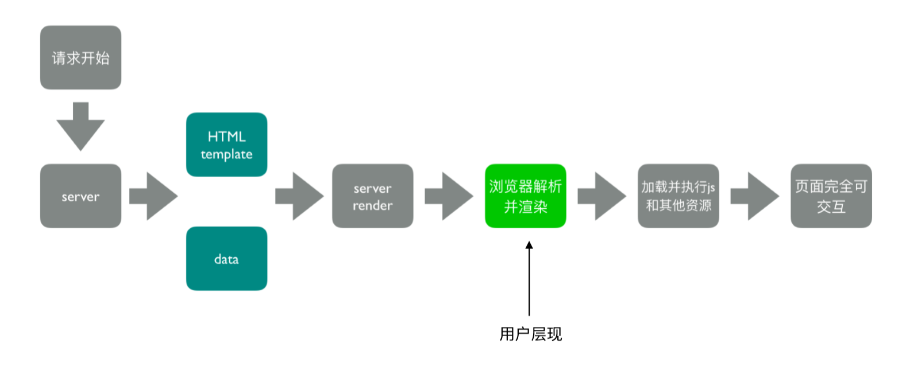
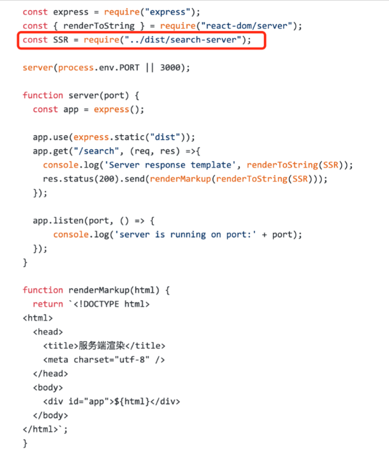

# 1.服务端渲染(SSR)是什么
渲染：HTML+CSS+JS+Data ->渲染后的HTML  

服务端：  
- 所有模板等资源都存储在服务端
- 内网机器拉取数据更快
- 一个HTML返回所有数据
# 2.浏览器和服务器交互流程
  
# 3.客户端渲染 VS 服务端渲染
  
总结：服务端渲染(SSR)的核心是减少请求  
# 4.SSR优势
- 减少白屏时间
- 对于SEO(搜索引擎优化)友好
# 5.SSR代码实现思路

## 5.1服务端
- 使用react-dom/server的renderToString方法将React组件渲染成字符串
- 服务器路由返回对应的模板
## 5.2客户端
- 打包出针对服务端的组件
## 5.3核心实现分为以下几步：
- 1.后端拦截路由，根据路径找到需要渲染的react页面组件X
- 2.调用组件X初始化时需要请求的接口，同步获取到数据后，使用react的renderToString方法对组件进行渲染，使其渲染出节点字符串
- 3.后端获取基础HTML文件，把渲染出的节点字符串插入到body之中，同时也可以操作其中的title，script等节点。返回完整的HTML给客户端
- 4.客户端获取后端返回的HTML,展示并加载其中的JS,最后完成react同构。
# 6.webpack ssr打包存在的问题
## 6.1浏览器的全局变量(Node.js中没有document,window)
- 组件适配：将不兼容的组件根据打包环境进行适配
- 请求适配：将fetch或者ajax发送请求的写法改成isomorphic-fetch或者axios  
isomorphic-fetch可以使我们加载额外的Polyfill库来使老式浏览器兼容fetch API,同时照顾node和browser环境  
```
npm install --save isomorphic-fetch es6-promise
```
```
require('es6-promise').polyfill();
require('isomorphic-fetch');

fetch('//offline-news-api.herokuapp.com/stories')
	.then(function(response) {
		if (response.status >= 400) {
			throw new Error("Bad response from server");
		}
		return response.json();
	})
	.then(function(stories) {
		console.log(stories);
	});
```
fetch函数的参数本质就是一个request，函数本身返回一个promise，可以通过then方法接收一个Response实例  

fetch的polyfill是为了支持更多的浏览器
## 6.2样式问题(Node.js无法解析css)
- 方案一：服务器打包通过ignore-loader忽略掉CSS的解析  
安装：
```
npm install filter-ignore-loader --save-dev
```
配置项  
    - test[Array]:匹配文件规则，匹配后文件内容将被替换为template内容。假如不配置，则所有文件都会被替换
    - template:替换后的文件内容，默认空字符串
```
// webpack配置
const webpackConfig = {
    entry: {
        index: './test/index.js'
    },
    output: {
        path: path.resolve(__dirname, 'dist'),
        filename: '[name].js',
        publicPath: ''
    },
    module: {
        rules: [{
            test: /\.*.js/,
            use: [
                {
                    loader: path.resolve(__dirname, '../index'),
                    options: {
                        test: ['ignore'],
                        template: 'console.log("ignore-template");'
                    }
                }
            ]
        }]
    }
};
```
- 方案二：将style-loader替换成isomorphic-style-loader    
isomorphic-style-loader 专门用于同构的style-loader  

安装：  
```
$ npm install isomorphic-style-loader --save-dev
```
webpack配置：
```
module.exports = {
  /* ... */
  module: {
    rules: [
      {
        test: /\.css$/,
        use: [
          'isomorphic-style-loader',
          {
            loader: 'css-loader',
            options: {
              importLoaders: 1
            }
          },
          'postcss-loader'
        ]
      }
    ]
  }
  /* ... */
}
```
# 7.如何解决样式不显示的问题
- 使用打包出来的浏览器端html为模板
- 设置占位符，动态插入组件

# 8.首屏数据如何处理
- 服务端获取数据
- 替换占位符
   
 
**利用replace()方法来进行替换**
```

if (typeof window === 'undefined') {
    global.window = {};
}

const fs = require('fs');
const path = require('path');
const express = require('express');
const { renderToString } = require('react-dom/server');
const SSR = require('../dist/search-server');
const template = fs.readFileSync(path.join(__dirname, '../dist/search.html'), 'utf-8');
const data = require('./data.json');

const server = (port) => {
    const app = express();

    app.use(express.static('dist'));
    app.get('/search', (req, res) => {
        const html = renderMarkup(renderToString(SSR));
        res.status(200).send(html);
    });

    app.listen(port, () => {
        console.log('Server is running on port:' + port);
    });
};

server(process.env.PORT || 3000);

const renderMarkup = (str) => {
    const dataStr = JSON.stringify(data);
    return template.replace('<!--HTML_PLACEHOLDER-->', str)
        .replace('<!--INITIAL_DATA_PLACEHOLDER-->', `<script>window.__initial_data=${dataStr}</script>`);
}
```
