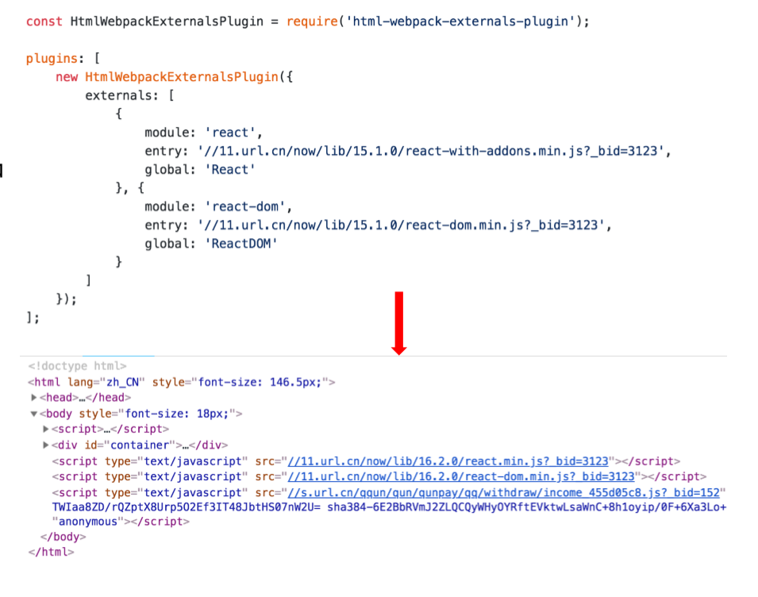
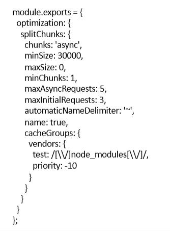
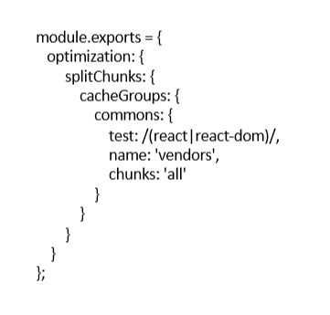
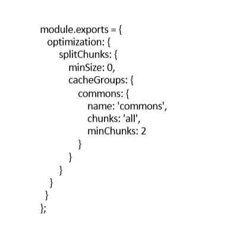

## 1.基础库分离
- 思路：将react、react-dom基础包通过cdn引入，不打入bundle中
- 方法：使用html-webpack-externals-plugin  
  
### 1.1代码分割
 它允许你将一个文件分割成多个文件。如果使用的好，它能大幅提升你的应用的性能。其原因是基于浏览器会缓存你的代码这一事实。每当你对某一文件做点改变，访问你站点的人们就要重新下载它。然而依赖却很少变动。如果你将（这些依赖）分离成单独的文件，访问者就无需多次重复下载它们了。
## 2.利用SplitChunksPlugin进行公共脚本分离
Webpack4内置的，替代CommonsChunkPlugin插件  
正是有了SplitChunksPlugin插件，你能在你的应用中移出一部分到单独的文件中。如果一个模块被多个chunks使用，（分割出它之后）就能很容易的在这些chunks之间共享。这正是webpack的默认行为。  
  
- chunks:表示哪些代码需要优化：  
    - async异步引入的库进行分离(默认)
    - initial同步引入的库进行分离
    - all所有引入的库进行分离(推荐)
- minSize:表示在压缩前的最小模块大小，默认为30000
- minChunks:表示被引用次数，默认为1
- maxAsyncRequests:按需加载时候最大的并行请求数，默认为5
- maxInitialRequests:一个入口最大的并行请求数，默认为3
- automaticNameDelimiter:命名连接符
- name:拆分出来块的名字，默认由块名和hash值自动生成
- cacheGroups:缓存组。缓存组的属性除上面所有属性外，还有test, priority, reuseExistingChunk
    - test:用于控制哪些模块被这个缓存组匹配到
    - priority:缓存组打包的先后优先级
    - reuseExistingChunk:如果当前代码块包含的模块已经有了，就不在产生一个新的代码块
## 3.利用SplitChunksPlugin分离基础包

## 4.利用SplitChunksPlugin分离页面公共文件
