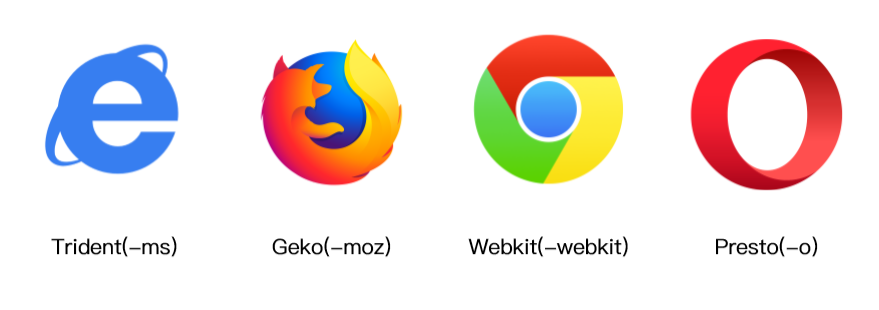
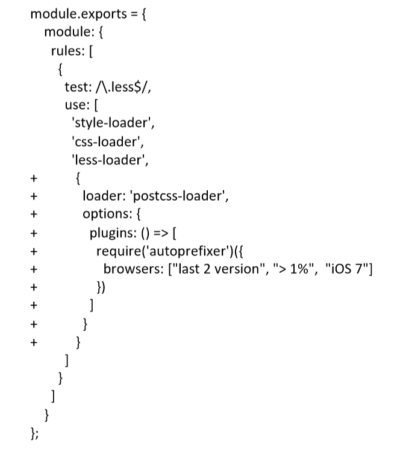

# CSS3前缀

# PostCSS插件autoprefixer自动补齐CSS3前缀
  
数组内参数含义：
- last 2 versions: 每个浏览器中最新的两个版本。
- \> 5% or >= 5%: 全球浏览器使用率大于5%或大于等于5%（上例中则是1%）。
- ie 6-8: 选择包含ie6-8的版本。
- Firefox > 20: 火狐版本号大于20。  
  
有时会把浏览器规则单独写在package.json上